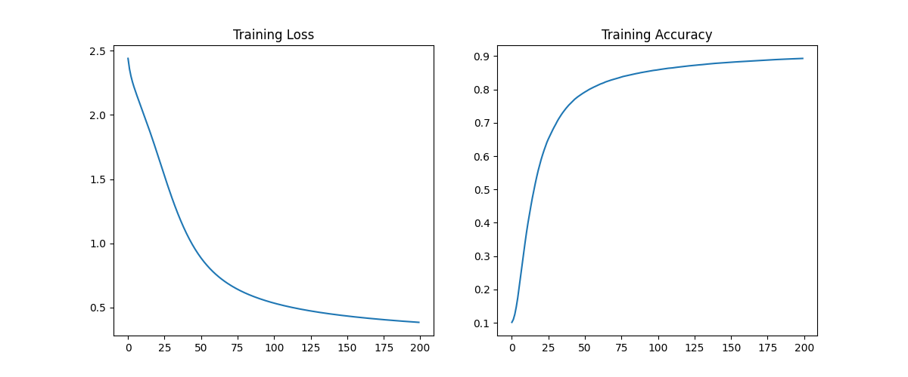

MNIST Handwritten Digit Classification

Neural Network from Scratch using NumPy

Overview

This project implements a fully connected neural network from scratch using NumPy to classify handwritten digits from the MNIST dataset.
All core components—forward propagation, backpropagation, and gradient descent—are implemented manually without using deep learning frameworks such as TensorFlow or PyTorch.

A key part of this work is the training convergence analysis, comparing batch gradient descent with mini-batch gradient descent, demonstrating how optimization strategy impacts learning efficiency.

Model Architecture

Input Layer: 784 neurons (28×28 flattened image)

Hidden Layer 1: 128 neurons, ReLU activation

Hidden Layer 2: 64 neurons, ReLU activation

Output Layer: 10 neurons, Softmax activation

784 → 128 → 64 → 10

Features

Fully connected dense neural network

He weight initialization

ReLU and Softmax activations

Forward propagation

Backpropagation using the chain rule

Categorical Cross-Entropy loss

Vanilla batch gradient descent

Mini-batch gradient descent

Unit tests for forward and backward passes

Training and evaluation on MNIST

Loss and accuracy visualization

Project Structure
MNIST_NN_FROM_SCRATCH/
│
├── model.py # Neural network implementation
├── train.py # Training and evaluation
├── tests.py # Unit tests
├── README.md # Documentation
├── requirements.txt
└── .gitignore

Requirements

Install dependencies using:

pip install -r requirements.txt

Libraries

Python 3.x

NumPy

scikit-learn

pandas

matplotlib

How to Run

1. Run Unit Tests
   python tests.py

Verifies correctness of:

Forward pass output dimensions

Backpropagation gradient dimensions

Expected output:

All tests passed!

2. Train the Model
   python train.py

This trains the model, prints epoch-wise loss and accuracy, evaluates test performance, and displays training plots.

Training Convergence Report
Before: Batch Gradient Descent

The initial training used vanilla batch gradient descent, where model parameters were updated once per epoch using the entire training dataset.

Observations

Very slow convergence

Model failed to converge effectively even after 100 epochs

Accuracy plateaued early

High computational cost on CPU

Plots

Training loss and accuracy (Batch Gradient Descent)

Conclusion
Batch gradient descent, while mathematically correct, was inefficient for this task and hardware setup.

After: Mini-Batch Gradient Descent

To improve training efficiency, mini-batch gradient descent was introduced.

Key Changes

Mini-batch size: 128

Multiple updates per epoch

Same architecture and loss function

Same CPU-only environment

Observations

Faster and more stable convergence

Model achieved over 90% accuracy within 20–30 epochs

Smooth loss reduction

Significantly reduced training time

Plots

Training loss and accuracy (Mini-Batch Gradient Descent)

Conclusion
Mini-batch gradient descent significantly improved convergence speed and training stability, enabling efficient learning with far fewer epochs.

Comparison Summary
Aspect Batch Gradient Descent Mini-Batch Gradient Descent
Epochs required 100–250 20–30
Updates per epoch 1 Multiple
Convergence speed Slow Fast
CPU efficiency Low High
Practical usability Poor Good
Final Results

Training Accuracy: ~90–92%

Test Accuracy: ~90–93%

Optimizer: Mini-Batch Gradient Descent

Loss Function: Categorical Cross-Entropy

Hardware: CPU only

Key Learnings

Correct activation–loss pairing is critical (Softmax + Cross-Entropy)

Optimization strategy strongly affects convergence

Batch gradient descent is inefficient for large datasets

Mini-batch training provides faster and more stable learning

End-to-end understanding of neural networks without frameworks

Future Improvements

Adam or Momentum-based optimizers

Regularization (L2, Dropout)

Convolutional Neural Networks

Early stopping

Author

Mukhesh Kumar Reddy
