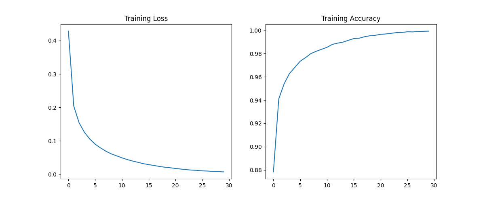

MNIST Handwritten Digit Classification
Neural Network from Scratch using NumPy

"""

OVERVIEW

This project implements a fully connected neural network from scratch using NumPy to classify handwritten digits from the MNIST dataset.

All core components — forward propagation, backpropagation, and gradient descent — are implemented manually without using deep learning frameworks such as TensorFlow or PyTorch.

A key focus of this work is training convergence analysis, comparing batch gradient descent and mini-batch gradient descent, demonstrating how optimization strategy impacts learning efficiency.

"""

MODEL ARCHITECTURE

Input Layer: 784 neurons (28 × 28 flattened image)

Hidden Layer 1: 128 neurons, ReLU activation

Hidden Layer 2: 64 neurons, ReLU activation

Output Layer: 10 neurons, Softmax activation

784 → 128 → 64 → 10

"""

FEATURES

Fully connected dense neural network

He weight initialization

ReLU and Softmax activation functions

Forward propagation

Backpropagation using the chain rule

Categorical Cross-Entropy loss

Vanilla batch gradient descent

Mini-batch gradient descent

Unit tests for forward and backward passes

Training and evaluation on MNIST

Loss and accuracy visualization

"""

PROJECT STRUCTURE
MNIST_NN_FROM_SCRATCH/
│
├── model.py
├── train.py
├── tests.py
├── images/
│   ├── before_training.png
│   └── after_training.png
├── README.md
├── requirements.txt
└── .gitignore

"""

REQUIREMENTS

Install dependencies using:

pip install -r requirements.txt

Libraries Used

Python 3.x

NumPy

scikit-learn

pandas

matplotlib

"""

HOW TO RUN
1. Run Unit Tests
python tests.py

Expected output:

All tests passed!

2. Train the Model
python train.py

This will:

Train the model on MNIST

Print epoch-wise loss and accuracy

Evaluate test performance

Display training plots

"""

TRAINING CONVERGENCE REPORT

"""

BEFORE: BATCH GRADIENT DESCENT

The initial training used vanilla batch gradient descent, where model parameters were updated once per epoch using the entire training dataset.

Observations

Very slow convergence

Model did not converge effectively even after 100 epochs

Accuracy plateaued early

High computational cost on CPU

"""

 INSERT BEFORE TRAINING PLOTS HERE

"""

Conclusion
Batch gradient descent, while mathematically correct, was inefficient for this task and hardware setup.

"""

AFTER: MINI-BATCH GRADIENT DESCENT

To improve training efficiency, mini-batch gradient descent was introduced.

Key Changes

Mini-batch size: 128

Multiple parameter updates per epoch

Same architecture and loss function

Same CPU-only environment

Observations

Faster and more stable convergence

Model achieved over 90% accuracy within 20–30 epochs

Smooth loss reduction

Significantly reduced training time

"""

 INSERT AFTER TRAINING PLOTS HERE

"""

Conclusion
Mini-batch gradient descent significantly improved convergence speed and training stability.

"""

COMPARISON SUMMARY
Aspect	Batch Gradient Descent	Mini-Batch Gradient Descent
Epochs required	100–250	20–30
Updates per epoch	1	Multiple
Convergence speed	Slow	Fast
CPU efficiency	Low	High
Practical usability	Poor	Good

"""

FINAL RESULTS

Training Accuracy: ~90–92%

Test Accuracy: ~90–93%

Optimizer: Mini-Batch Gradient Descent

Loss Function: Categorical Cross-Entropy

Hardware: CPU only

"""